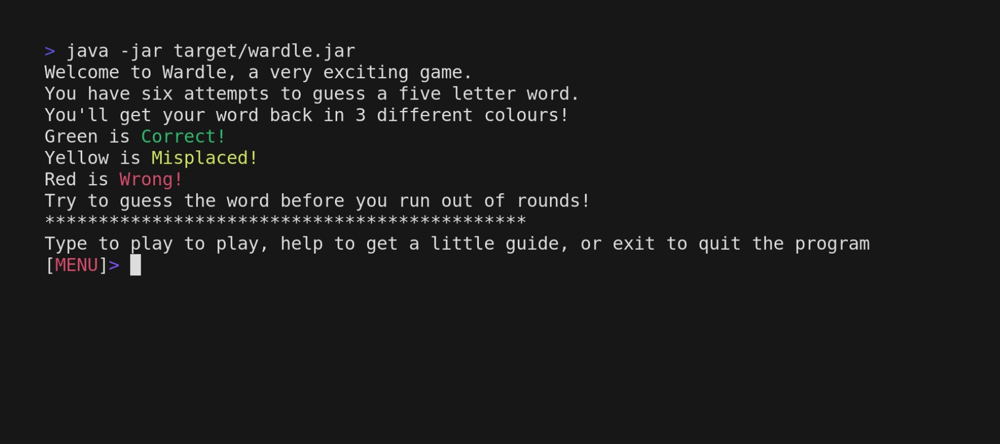

# wardle
A terminal/graphical copy of wordle

This is currently a very simple basic copy of wordle. More feature coming soon. (Trust me)

# Build instructions
First, make sure you have java version 17 or higher and the latest version of apache maven

```bash
# Download game
git clone https://github.com/gecotron/wardle.git
cd wardle 
# Package game
mvn package
# Run it
java -jar target/wardle.jar
```
After you've run the project the first time, you just need to run `java -jar /PATHTO/wardle.jar` to run the game from anywhere, as long as the path is correct.  
To make it easier to run, add an alias to you shell config to run it. 
